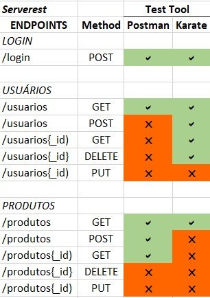

# Software Quality - Portfolio
  

---
## 📋 Contents

- [About](#about)
- [Tools Used](#🛠️tools-used)
- [Type Tests](#type-tests)
- [Tested E2E Sites](#tested-e2e-sites)
- [Tested API Services](#tested-api-services)
- [How To Execute Projects](#🚀how-to-execute-projects)

---
## About  
This repository (portfolio) contains test cases that I created with the aim of training my skills in the area of ​​QA and DevOps.  
You can check various tests carried out both in terms of system and integration testing.🧪  
These tests are automated and integrated to run automatically in Github Action.🤖

<!-- This repository (portfolio) contains test cases created to enhance my skills in QA and DevOps.

You can explore various tests, including system and integration testing. These tests are automated and integrated to run automatically in GitHub Actions.🧪🤖 -->

---

## 🛠️Tools Used
### 🧪 Testing Tools

  
Cypress✅

    You can check the tests in the following folders:

* Cypress Graduation
* Cypress_Portfolio

  
Karate API✅

    You can check the tests in the following folders:

- KarateAPI_Graduation
- KarateAPI_Portfolio

  
Postman✅

    You can check the tests in the following folder:

- Postman

**Selenium** COMING SOON   
**Robot** COMING SOON  

### 🤖 CI/CD - Automation
**GitHub Actions**✅  
**Jenkins** COMING SOON   

---
##  Type Tests
The goal is to add all types of tests to the pipeline. 
- **Interface Test** ✅
- **System Test** ✅
- **Integration Test** ✅
- **Unit Test** COMING SOON
- **Performance Test** COMING SOON

<!-- **Interface Test**✅ 
**System Test**✅ 
**Integration Test**✅ 
**Unit Test** - on pipeline COMING SOON  
**Performance Test** COMING SOON    -->

---
## Tested E2E Sites
- **SauceDemo** ✅: An e-commerce demo application.
- **Inatel/home** ✅: The homepage of Inatel.
- **GlobalSQA/loginexample** ✅: A login example site for testing purposes.

---
## Tested API Services
The main services used for creating API tests were Serverest and Karate DSL. 
Below is a table with the endpoints tested and the tools used.
<!--  -->

 

**Tests created using these services:**
- Serverest
- Karate API
  - Reqres
  - RickAndMortyAPI
  - PokeAPI
  - SWAPI
  - JsonPlaceholder

---
 

## 🚀How To Execute Projects

Each project folder will contain the steps necessary to execute them.

Please refer to the `README` files within each folder for detailed instructions.

<!-- 🚧This section is under construction...🚧 -->
🚧It is under construction...🚧

<!-- 
<strong>First</strong>, you need these software instaled:

* Git
* Node.js
* VS Code

 

<strong>Second:</strong> Do the Git Clone.  

 

<strong>Third:</strong> Choose which project you want to open and then open the chosen project(folder) in VSCode 

 

<strong>Fourth:</strong> Let's open the Cypress or Just run tests  

Before you need the Cypress instaled, so run this command 'npm install cypress -D'  
And then you can <strong>choose one</strong>,  
Run this 'npx Cypress open' to open Cypress  
Run this 'npx Cypress run' just run all tests, give you the results and the video.

---

### Start(Create) a new Project
"npm init -y" -> inicia o projeto trazendo o package.json(configurações)  
"npm install cypress -D" -> instala o cypress  
"npx Cypress open" -> abrir o cypress  
"npx Cypress run" -> Roda todos os testes e gera um video de cada teste -->
